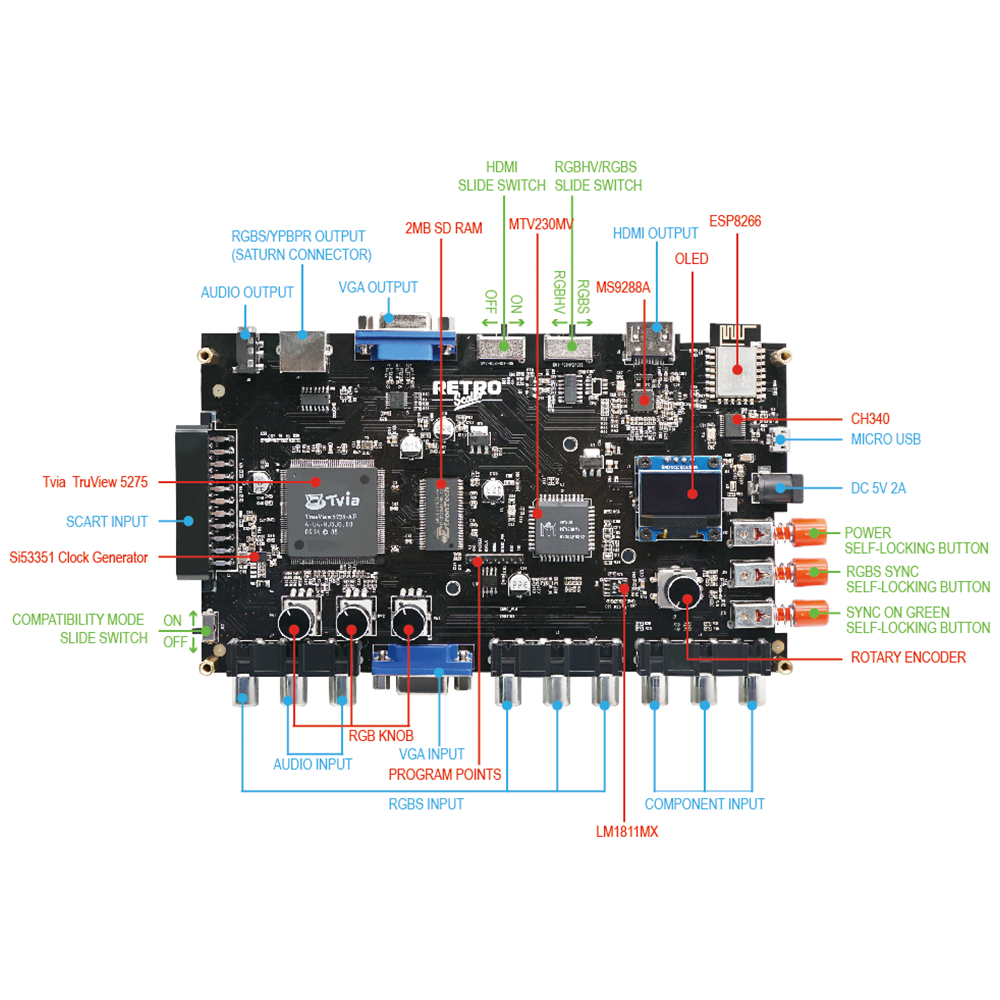
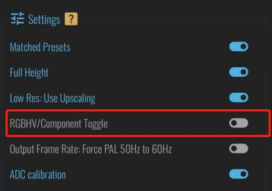

I will be trying to back port the GBSC Pro fw back to this version removing all extra features that dont work on this model and fixing the Webui 

will base the backport on the incredible work by https://github.com/brisma/gbsc-pro
-------------------------------------------------------------------------------------------------------------

# GBSC-Pro Firmware for Base GBSC Hardware

This is GBSC-Pro firmware backported to run on the **base GBSC** board (no ADV/HC32F460, no STV9426 TV-OSD, no PT2257 audio attenuator, no IR receiver). All hardware-dependent drivers are no-op'd (APIs preserved, bodies emptied) so the firmware compiles cleanly and the missing chips are never touched.

## What works on base hardware

- **OLED menu + rotary encoder** — full navigation, presets, all settings
- **36 profile slots** (A–Z, 0–9) with per-slot TV5725 register programs
- **PRO Web UI** — PWA with slots, WiFi management, all PRO settings, developer overrides
- **Developer overrides** — NTSC/PAL Htotal, PLL div, SDRAM clock, ADC filter, OSR, SOG level, sync invert, screen move/scale
- **gbsColor** (R/G/B color balance), **hdmiLimitedRange**, **PAL-60 forcing**
- **Sync automation** — SOG/phase auto-tuning, auto-best Htotal, input detection
- **WiFi + WebSocket status**, mDNS `gbscontrol.local`, AP fallback
- **Frame-time lock (FTL)**, deinterlacing, scanlines, VDS filters
- **HDMI limited-range**, YPbPr/component output, HD bypass, RGBHV scaling/bypass
- **ADC auto-gain + offset calibration**
- **Si5351 external clock generator** support

## What is disabled (no hardware on base GBSC)

| Feature | Requires | Status |
|---|---|---|
| S-Video / composite input | ADV7280/ADV7391 + HC32F460 (ADV MCU) | No-op stub |
| TV OSD (on-screen display) | STV9426 chip | No-op stub |
| Audio volume / mute | PT2257 attenuator | No-op stub |
| IR remote control | IR receiver diode | No-op stub (decode always returns false) |

These features are **inert** — no UART, I2C, or GPIO traffic is generated for them. They can be safely ignored in the menu/web UI.

## Notable changes vs stock GBSC-Pro firmware

1. **Rotary encoder rewritten** — replaced the buggy 100 ms-gate single-cell handoff with a quadrature transition accumulator. Fixes missed rotations (fast flicks no longer drop clicks) and double jumps (contact bounce nets out atomically). Enter button uses a separate 30 ms-debounced flag.
2. **All missing-hardware drivers no-op'd** — `adv_controller.h`, `pt2257.h`, `stv9426.h`, `ir_remote.h` have empty bodies but preserve every public symbol so higher-level code compiles unchanged.
3. **AGENTS.md** — 676-line canonical repo guide (architecture, data flow, persistence map, build pipeline, invariants, gotchas).

## Building

```bash
cd gbs-control
pio run
# output: .pio/build/gbsc-pro/firmware.bin  (~785 KB)
```

Toolchain: PlatformIO, `espressif8266@4.2.1`, `d1_mini` (4 MB flash, LittleFS, 160 MHz).

## Flashing

```bash
# Option A: via PlatformIO
cd gbs-control && pio run --target upload

# Option B: via the Python flasher
pip install pyserial esptool
python gbsc-pro-flasher/gbsc_flasher.py --esp gbs-control/.pio/build/gbsc-pro/firmware.bin
```

**Hardware note:** GPIO0 (rotary encoder push) must be pulled HIGH at power-on or the ESP8266 will not boot.

## Repository layout

| Path | Purpose |
|---|---|
| `gbs-control/` | ESP8266 firmware (PlatformIO project) |
| `gbs-control/pro/` | GBSC-Pro layer (menu, OSD, drivers — drivers no-op'd) |
| `gbs-control/public/` | Web UI source (TypeScript PWA) + build tooling |
| `gbsc-pro-flasher/` | Python GUI/CLI flasher (ESP8266 + ADV) |
| `AGENTS.md` | Canonical repo guide (architecture, invariants, build steps) |

## Provenance

- Base firmware: [ramapcsx2/gbs-control](https://github.com/ramapcsx2/gbs-control)
- Pro fork: [brisma/gbsc-pro](https://github.com/brisma/gbsc-pro)
- Firmware version: `GBS_FW_VERSION 2.4.1`

---

# GBSC
**INTRODUCTION** 

 

GBS control is an improved GBS8200 RGB to VGA converter board, and an alternative firmware for Tvia Trueview5725 based upscales / video converter boards.

 

The firmware of this device is powered by gbs-control designed by ramapcsx2, used with permission under an open-source copyright.

https://github.com/ramapcsx2/gbs-control

 

Note: 

1. This device can not support composite and S-video signal. 

2. HDMI output and VGA output cannot work normally at the same time, you only need to keep one of them connecting. 

3. If you want to switch the video input signal (when you have more than one input video sources connecting into this device), you need to power off this device first. 

 

**FEATURES**

 

1. Almost zero latency.

2. Supports most of the retro video game consoles.

3. Supports RGBS, RGSB, RGBS SCART, RGBHV, Component, VGA input。

4. Supports RGBS, VGA, Component, HDMI Output.

5. Supports high-fidelity audio output.

6. Build in Si5351 stable clock generator.

7. Supports Video image adjustment.

8. Ability to balance the amplitude of the three primary color signals - R, G, B.

9. Supports Upscaling to 1080p. 

10. Supports Downscaling to 240p/288p (only output through Saturn A/V connector).

11. No synchronization loss switching 240p/480i, 288p/576i.

12. Supports resolutions (240p/288p/480i/480p/576i/576p/640p/720p/960p/1024p/1080p).

13. OLED screen and WIFI web configuration pages help you make the settings. 

14. Support firmware upgrade through micro-USB interface.

 

**SIGNAL INPUT AND OUTPUT INTRODUCTION** 

 

**Micro USB:**

It only supports firmware upgrade and cannot supply power for the normal working of this device. If you need to update the firmware, please see “Firmware Updates Guide”. 

 

 

**RGBS SYNC SELF-LOCKING BUTTON:**

When Press Down: Using an LM1881 chip to “strip” the sync information from composite video.

When the switch popped: by pass the composite signal.

 

**SYNC ON GREEN SELF-LOCKING BUTTON:** 

When the **Button** pressed down, this device can accept the VGA, RGBHV, RGSB signal. 

When the **Button** popped, this device can accept the RGBS and Component (YPbPr) signal. 

Note: 

When this **Button** pressed, this device can extract and use the sync signal attached to the Green signal, so the RGsB signal (such as the progressive scan mode on the retro game console) acceptable, but the “**SYNC ON GREEN** **SELF-LOCKING BUTTON** and the “**RGBS SYNC** **SELF-LOCKING BUTTON “** must be pressed simultaneously.

 

**POWER SELF-LOCKING BUTTON:**

The **Button** pressed down and this device is POWERED ON.

 

**DC 5V 2A:**

Connect a suitable 5V2A, 2.1 x 5.5mm PSU.

**Audio Output:**

Standard 3.5mm stereo headphone plugs type connector. Output high-fidelity audio.

 

**HDMI Output:**

Output HDMI digital signal. 

 

**RGBS/YPBPR OUTPUT (SATURN A/V CONNECTOR)**

If you want RGBS output (which must through the Saturn A/V connector), you need slide “RGBHV/RGBS SLIDE SWITCH” to the “RGBS” side.

If you want Component signal output through the Saturn A/V connector, you also need to turn on the “RGBHV/Component Toggle” in the web settings page.



**Note:**

 1. The **HDMI SLIDE SWITCH** much slide to “OFF” if you want to output RGBS/Component signal through the Saturn A/V connector

 2. The GBSC only output low resolution (240p/288p) RGBS signal through the Saturn A/V connector. 

 

**VGA OUTPUT**

Standard D-Sub15 (VGA) connector. 

**NOTE:** 

If you want to output VGA signal through this interface, The “HDMI SLIDE SWITCH” much slide to “OFF”.

 

**HDMI SLIDE SWITCH:**

Toggles the HDMI signal OFF and ON.

 

**RGBHV/RGBS SLIDE SWITCH:** 

If you want to output RGBS signal, please slide this switch to “RGBS” side. In other cases, please keep RGBHV by default.

**NOTE:** 

This function is used as RGBHV (VGA) to RGBS signal output, please SLIDE “**HDMI SLIDE SWITCH**” to OFF when using the RGBS output.

 

**SCART input:**

The European standard SCART interface can only receive RGBS signals. The less common Japanese JP21 SCART must be used with a converter.

 

**VGA input:**

Standard D-Sub15 (VGA) connector, accept the VGA and RGBHV signal, Can also receive RGsB signal. 

**NOTE:**

If you use this interface, you must press down the switch ”SYNC ON GREEN **SELF-LOCKING BUTTON**”

 

**Component input:**

Accept the Component (YPBPR) signal.

**NOTE****：**

The “SYNC ON GREEN **SELF-LOCKING BUTTON**” and “RGBS SYNC **SELF-LOCKING BUTTON**” much stays in popped.

 

**Audio INPUT:**

Left and right audio input.

 

**RGBS input:**

Accept the RGBS signal, I suggest you pressed on the “RGBS SYNC **SELF-LOCKING BUTTON**” to get a clean sync signal through the LM1881 chip when using the RGBS.

**NOTE****：**

If you are input a progressive scan RGBS signal (normally 480p or 576p), please keep press down these two switch at the same time. The “RGBS SYNC **SELF-LOCKING BUTTON**” and”SYNC ON GREEN **SELF-LOCKING BUTTON**”.

 

**RGB KNOB****：**

Adjust the red, green and blue signals intensity of the output images

 

**COMPATIBILITY MODE SLIDE SWITCH:**

Toggles compatibility mode ON and OFF

NOTE: The “Sega 32x/Neo Geo AES” console needs to slide to ON, and then restart GBSC to take effect; other consoles stay in OFF.
